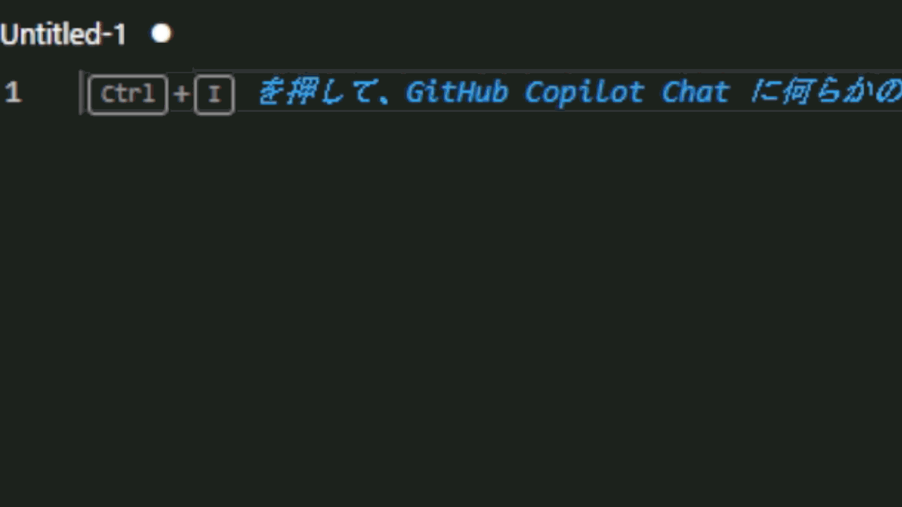

# voicevox-snippets

vscode 内で VOICEVOX のキャラやオプションをスニペッツとして追加できます。 
複数のキャラが出る原稿作成などで使えます。

## 詳細

vscode に読み込んだテキストファイル内で使うことが出来ます。
スニペッツが出ない場合は右下の拡張子が.plaintext またはプレーンテキストとして読み込まれているか確認してみてください

## オプションのつけ方

① あまあまなどのオプションがつけられているキャラを入力 
② オプションが出るので不要なら BackSpace や Delete,必要なら"("を入力 
③ 自動で")"も補完されるのでその中にオプション名を入力 
 
オプション名を入力する際にノーマルやあまあまなどのいくつかのオプションは補完が効きます。 
現在補完が対応しているオプションが少ないのでそのうち追加します 

## 拡張機能の追加

VSCODE の拡張機能検索欄から voicevox-snippets と検索すると出てくると思います。

## その他

動かないことやわからないことがあれば issue などを作成していただければ気づいたときに出来る限り答えます。 
キャラが増えたりした際には気が向いたときに更新したいと思います。
